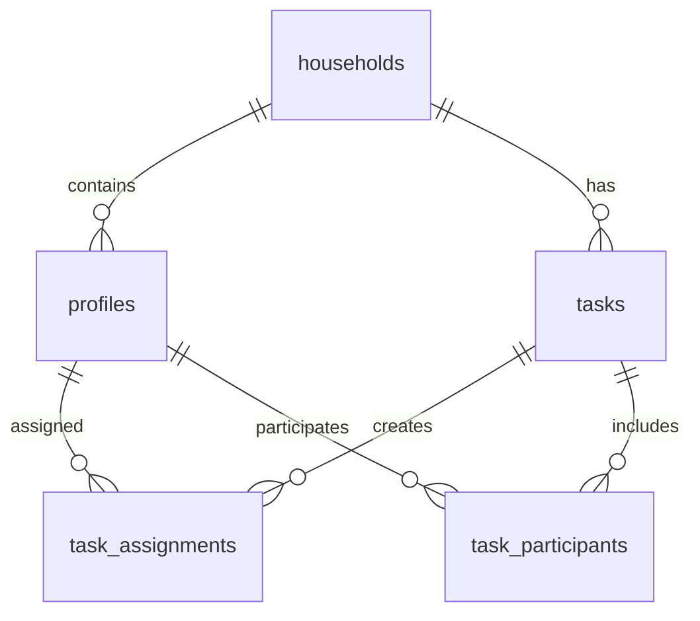

# 🏠 TaskMate - Shared Household Task Management

**TaskMate** is a free mobile application designed for shared household task management among friends and roommates. Built with React Native (Expo) and Supabase, it features automatic task rotation, gamification, and bilingual support.

## 🌟 Features

### Core Functionality
- 📝 **Task Management** - Create one-time and recurring tasks
- 🔄 **Automatic Rotation** - Tasks automatically rotate among household members
- 🔔 **Smart Notifications** - Persistent reminders until tasks are completed
- 🏆 **Gamification** - Points, streaks, and household leaderboards
- 👥 **Household Management** - Create and manage shared living spaces
- 🌍 **Bilingual Support** - English and French languages

### Advanced Features
- 👑 **Admin Controls** - Household admins can manage members and tasks
- 📊 **Progress Tracking** - Visual progress indicators and statistics
- ⚡ **Real-time Updates** - Live updates across all household members
- 🎯 **Task Categories** - Organize tasks by type (cleaning, maintenance, etc.)
- 📱 **Cross-Platform** - Works on both iOS and Android

## 🛠️ Tech Stack

### Frontend
- **[Expo](https://expo.dev/)** - React Native framework
- **[TypeScript](https://www.typescriptlang.org/)** - Type safety
- **[Tamagui](https://tamagui.dev/)** - UI components and styling
- **[Zustand](https://github.com/pmndrs/zustand)** - State management
- **[TanStack React Query](https://tanstack.com/query)** - Data fetching
- **[i18next](https://www.i18next.com/)** - Internationalization
- **[Expo Notifications](https://docs.expo.dev/versions/latest/sdk/notifications/)** - Push notifications

### Backend
- **[Supabase](https://supabase.com/)** - Backend as a Service
- **[PostgreSQL](https://www.postgresql.org/)** - Database
- **[Supabase Auth](https://supabase.com/docs/guides/auth)** - Authentication
- **[Supabase Realtime](https://supabase.com/docs/guides/realtime)** - Real-time updates

## 🚀 Quick Start

### Prerequisites
- [Node.js](https://nodejs.org/) (v18 or higher)
- [npm](https://www.npmjs.com/) or [yarn](https://yarnpkg.com/)
- [Expo CLI](https://docs.expo.dev/get-started/installation/) or [Expo Go](https://expo.dev/client) app
- [Supabase](https://supabase.com/) account

### Installation

1. **Clone the repository**
   ```bash
   git clone https://github.com/yourusername/taskmate.git
   cd taskmate
   ```

2. **Install dependencies**
   ```bash
   npm install
   # or
   yarn install
   ```

3. **Set up environment variables**
   ```bash
   cp .env.example .env
   ```
   
   Edit `.env` with your Supabase credentials:
   ```env
   EXPO_PUBLIC_SUPABASE_URL=your_supabase_url
   EXPO_PUBLIC_SUPABASE_ANON_KEY=your_supabase_anon_key
   ```

4. **Set up MCP configuration (optional)**
   If you're using Cursor with Supabase MCP server, create `.cursor/mcp.json`:
   ```bash
   mkdir -p .cursor
   ```
   
   Create `.cursor/mcp.json` with your Supabase project details:
   ```json
   {
     "mcpServers": {
       "supabase": {
         "command": "npx",
         "args": [
           "-y",
           "@supabase/mcp-server-supabase@latest",
           "--project-ref=your_supabase_project_ref"
         ],
         "env": {
           "SUPABASE_ACCESS_TOKEN": "your_supabase_access_token"
         }
       }
     }
   }
   ```
   
   **⚠️ Important**: This file contains sensitive information and is already in `.gitignore`. Do not commit it to the repository.

5. **Start the development server**
   ```bash
   npm start
   # or
   yarn start
   ```

6. **Run on device/simulator**
   - Scan the QR code with Expo Go (Android) or Camera app (iOS)
   - Or press `i` for iOS simulator, `a` for Android emulator

## 🗄️ Database Setup

### Supabase Configuration

1. **Create a new Supabase project** at [supabase.com](https://supabase.com)

2. **Run the database migrations**
   ```sql
   -- Copy and run the SQL from database-schema.sql
   -- This creates all necessary tables and functions
   ```

3. **Set up Row Level Security (RLS)**
   ```sql
   -- Enable RLS on all tables
   ALTER TABLE households ENABLE ROW LEVEL SECURITY;
   ALTER TABLE profiles ENABLE ROW LEVEL SECURITY;
   ALTER TABLE tasks ENABLE ROW LEVEL SECURITY;
   ALTER TABLE task_assignments ENABLE ROW LEVEL SECURITY;
   ALTER TABLE task_participants ENABLE ROW LEVEL SECURITY;
   ```

4. **Configure authentication**
   - Enable email/password authentication
   - Set up redirect URLs for your app
   - Configure email templates (optional)

### Database Schema Overview



## 📱 App Structure

```
src/
├── components/          # Reusable UI components
│   ├── ui/             # Basic UI components
│   ├── forms/          # Form components
│   └── common/         # Common components
├── screens/            # App screens
│   ├── auth/          # Authentication screens
│   ├── dashboard/     # Dashboard screens
│   ├── tasks/         # Task management screens
│   ├── leaderboard/   # Leaderboard screens
│   └── profile/       # Profile screens
├── hooks/             # Custom React hooks
├── store/             # Zustand stores
├── services/          # API services
├── utils/             # Utility functions
├── types/             # TypeScript types
├── locales/           # Translation files
└── constants/         # App constants
```

## 🎮 Gamification System

### Points System
- **Task Completion**: 10 base points
- **Streak Bonus**: +5 points per day in streak
- **Early Completion**: +2 points if completed before due date
- **Difficult Task Bonus**: +5 points for tasks with longer duration

### Leaderboard Rankings
- **Weekly Leaderboard**: Points earned in the current week
- **Monthly Leaderboard**: Points earned in the current month
- **Streak Leaderboard**: Current and longest streaks

## 👑 Admin Features

Household admins have additional permissions:
- Edit household name and settings
- Generate and manage invite codes
- Remove household members
- Create tasks for all members
- Reassign tasks manually
- Reset user statistics
- Promote members to admin role

## 🌍 Internationalization

TaskMate supports multiple languages:
- **English** (default)
- **French**

To add a new language:
1. Create a new translation file in `src/locales/`
2. Add the language to the i18next configuration
3. Update the language selector in settings

## 📱 Screenshots

*Screenshots will be added once the app is developed*

## 🧪 Testing

### Running Tests
```bash
npm test
# or
yarn test
```

### Testing on Devices
- **iOS**: Use Expo Go app or iOS Simulator
- **Android**: Use Expo Go app or Android Emulator
- **Physical Device**: Scan QR code with Expo Go

## 🚀 Deployment

### Building for Production

1. **Configure app.json**
   ```json
   {
     "expo": {
       "name": "TaskMate",
       "slug": "taskmate",
       "version": "1.0.0",
       "icon": "./assets/icon.png",
       "splash": {
         "image": "./assets/splash.png"
       }
     }
   }
   ```

2. **Build the app**
   ```bash
   # For iOS
   eas build --platform ios
   
   # For Android
   eas build --platform android
   ```

3. **Submit to App Stores**
   ```bash
   # iOS App Store
   eas submit --platform ios
   
   # Google Play Store
   eas submit --platform android
   ```

## 🤝 Contributing

We welcome contributions! Here's how to get started:

1. **Fork the repository**
2. **Create a feature branch**
   ```bash
   git checkout -b feature/amazing-feature
   ```
3. **Make your changes**
4. **Commit your changes**
   ```bash
   git commit -m 'Add amazing feature'
   ```
5. **Push to the branch**
   ```bash
   git push origin feature/amazing-feature
   ```
6. **Open a Pull Request**

### Development Guidelines
- Follow the existing code style
- Add tests for new features
- Update documentation as needed
- Ensure all tests pass before submitting

## 📋 Development Roadmap

### Phase 1: Foundation ✅
- [x] Project setup and configuration
- [x] Database schema design
- [x] Authentication system
- [x] Basic UI components

### Phase 2: Core Features 🚧
- [ ] Task CRUD operations
- [ ] Task assignment and rotation
- [ ] Dashboard with statistics
- [ ] Task completion functionality

### Phase 3: Gamification & Admin 📅
- [ ] Points and streak system
- [ ] Leaderboard functionality
- [ ] Admin features
- [ ] User management interface

### Phase 4: Polish & Launch 📅
- [ ] Push notifications
- [ ] Real-time updates
- [ ] UI/UX improvements
- [ ] App store deployment

## 🐛 Known Issues

- [ ] Notification scheduling needs testing on iOS
- [ ] Rotation algorithm optimization needed
- [ ] French translations incomplete

## 📚 Resources

- [Expo Documentation](https://docs.expo.dev/)
- [Supabase Documentation](https://supabase.com/docs)
- [Tamagui Documentation](https://tamagui.dev/)
- [React Native Documentation](https://reactnative.dev/)

## 📄 License

This project is licensed under the MIT License - see the [LICENSE](LICENSE) file for details.

## 🙏 Acknowledgments

- [Expo](https://expo.dev/) for the amazing React Native framework
- [Supabase](https://supabase.com/) for the powerful backend platform
- [Tamagui](https://tamagui.dev/) for the beautiful UI components
- The open-source community for inspiration and tools

## 📞 Support

If you have questions or need help:
- Open an issue on GitHub
- Check the documentation
- Contact the development team

---

**Built with ❤️ for better household management**
